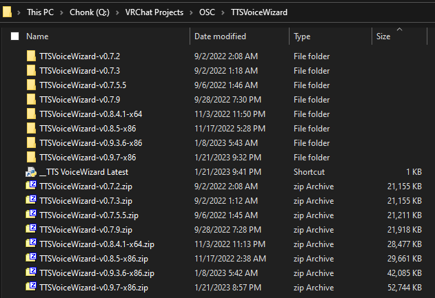

# Virus's Personal Scripts and Stuff

Hi there, this is a small repo of where I keep various different scripts that I have written for myself and other various needs as well as links to some of the other tools I use.

## Notes

notes go here.

### Things I use

misc. things I use that aren't VRC related

- [OpenVRStartup](https://github.com/BOLL7708/OpenVRStartup)
- [VoiceMeeter](https://voicemeeter.com/)
- [VB-CABLE](https://vb-audio.com/Cable/index.htm)

#### VRChat Development Tools and Assets

add dev tools here

For an more complete list of vrchat related information, check out [awesome-vrchat](https://github.com/madjin/awesome-vrchat). I found a lot of the tools and assets I use there.

Shaders

- [lilToon](https://github.com/lilxyzw/lilToon)
- [Poiyomi Toon Shader](https://github.com/poiyomi/PoiyomiToonShader)
- [Silent Cel Shading Shader](https://gitlab.com/s-ilent/SCSS)
- [Filamented](https://gitlab.com/s-ilent/filamented)
- [Unity-Chan Toon Shader 2.0](https://github.com/unity3d-jp/UnityChanToonShaderVer2_Project)

Avatar Tools

- [Blender to Unity FBX Exporter](https://github.com/EdyJ/blender-to-unity-fbx-exporter) (This one is a must have for blender work)
- [Pumkin's Avatar Tools](https://github.com/rurre/PumkinsAvatarTools)
- [OSC](https://github.com/vrchat-community/osc)
- [ComboGestureExpressions](https://github.com/hai-vr/combo-gesture-expressions-av3)
- [CATS Blender Plugin](https://github.com/absolute-quantum/cats-blender-plugin)
- [GoGo Loco](https://github.com/Franada/gogoloco)
- [Avatars 3.0 Manager](https://github.com/VRLabs/Avatars-3.0-Manager)
- [d4rkAvatarOptimizer](https://github.com/d4rkc0d3r/d4rkAvatarOptimizer)
- [VRCQuestTools](https://github.com/kurotu/VRCQuestTools)
- [Modular Avatar](https://github.com/bdunderscore/modular-avatar)

World Tools

- [VRWorldToolkit](https://github.com/oneVR/VRWorldToolkit)
- [UdonSharp](https://github.com/vrchat-community/UdonSharp)
- [ClientSim](https://github.com/vrchat-community/ClientSim)
- [VRC Bakery Adapter](https://github.com/MerlinVR/VRC-Bakery-Adapter)
- [Udon Toolkit](https://github.com/orels1/UdonToolkit)

World Assets

- [VRCBilliards: Community Edition](https://github.com/VRCBilliards/vrcbce)
- [VRChat Keypad](https://github.com/MolotovCherry/VRChat_Keypad)
- [USharpVideo](https://github.com/MerlinVR/USharpVideo)
- [Kurotori Udon Kart](https://github.com/kurotori4423/KurotoriUdonKart)

#### VRChat Related Tools

add useful tools and repos here, like OSC stuff

- [VRCX](https://github.com/vrcx-team/VRCX)
- [TTS Voice Wizard](https://github.com/VRCWizard/TTS-Voice-Wizard)
- [EyeTrackVR](https://github.com/RedHawk989/EyeTrackVR) (SoonTM)
- [Community VRChat API Documentation](https://github.com/vrchatapi/vrchatapi.github.io)

## TODO

Here's some stuff I'd like to do in the future in no particular order:

- get my server running again (Ubuntu)
  - Samba, PLEX, git, OctoPrint, pi-hole
- VR theramin with Quest 2 hand tracking (Unity)
- SAM twitch tts (Angular)
- SteamVR launch event utilization (OpenVRStartup)

## Documentation

### Python

#### [TTSVoiceWizardLatest.pyw](TTSVoiceWizardLatest.pyw)

I have multiple versions of this saved in the same folder so this just lets me launch the latest with a single click. This is fairly smol so it's self documenting but could adapted for multiple different things by swapping out the path and pattern search strings.

